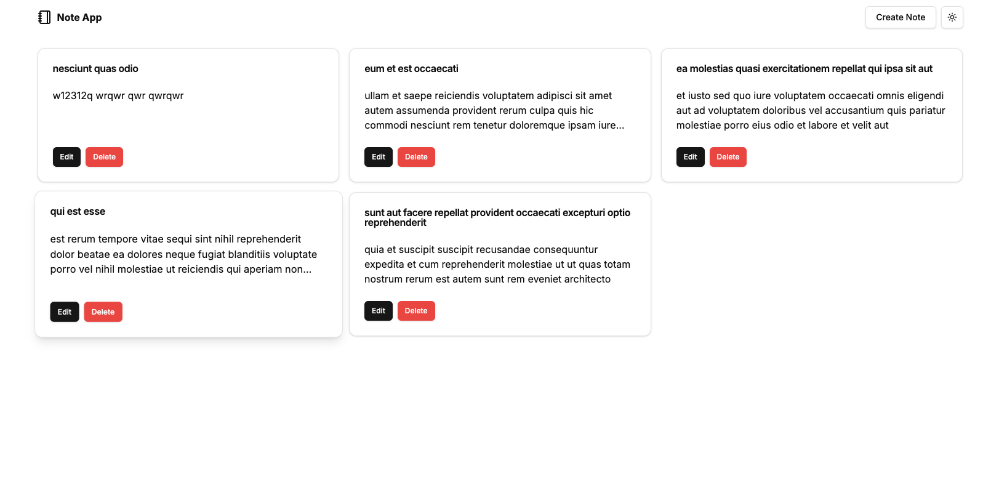

# **Note App**

[Note App](https://note-app-by-skynov.netlify.app/)



## **Description**

A simple note-taking app that allows you to create, read, update, and delete notes. Built with Next.js, RxDB, React Hook Form, and Shadcn UI.

## **Features**

- Create notes
- Read notes
- Update notes
- Delete notes
- Dark mode
- Responsive design
- Offline support

## **Installation**

1. Clone the repository:

```bash
git clone https://github.com/skynovua/note-app.git
```

2. Navigate to the project directory:

```bash
cd note-app
```

3. Install the dependencies:

```bash
npm install
```

4. Run the app:

```bash
npm run dev
```

## **Technologies**

- Next.js
- RxDB
- React Hook Form
- Shadcn UI
- Tailwind CSS

## **Author**

- [Anton Yanovskyi](https://github.com/skynovua)
